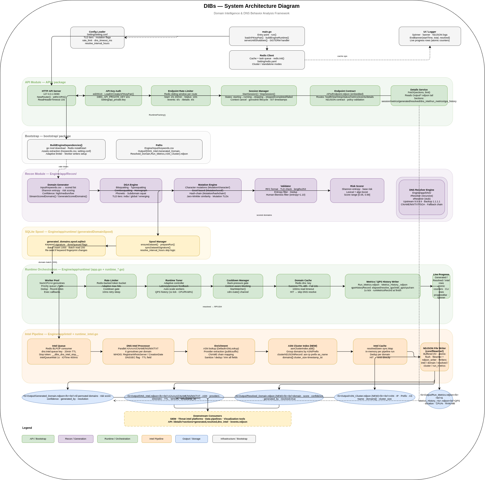

<div align="center">

# DIBs

**Domain Intelligence & Behavior System**

*A DNS Intelligence & Infrastructure Behavioral Analysis Framework*

[](./VERSION.md)

[](https://golang.org/)
[](https://github.com/)
[](LICENSE)
[](https://github.com/)
[](https://redis.io/)
[](https://www.kernel.org/)

[](#-reproducible-execution-snapshot)

*High-throughput domain intelligence, DNS resolution, and behavioral analysis at scale.*

---

[Overview](#overview) · [Version](#version)
· [Architecture](#architecture) · [Features](#features) · [Getting Started](#getting-started) · [API](#api-control-plane) · [Use Cases](#-use-cases) · [Citation](#citation)
</div>

---

## Overview

**DIBs** is a modular framework for generating, resolving, analyzing, and correlating domain intelligence at scale. It is designed for offensive security workflows, threat intelligence operations, and DNS telemetry analysis.

The system operates as a structured pipeline:

```

Domain Generation → DNS Resolution → Intelligence Extraction → Correlation → Output

````

Outputs are emitted as structured NDJSON, enabling integration with SIEM platforms and downstream processing systems.

This work is part of ongoing offensive security research conducted by `Biswadeb Mukherjee and his research lab`.

---

## Version

* Public Release Notes: [VERSION.md](./VERSION.md)

This release defines the system’s supported capabilities, operational guarantees, and known limitations.
Operators are encouraged to review the version contract before running large-scale workloads.

---

## Architecture

DIBs follows a unidirectional processing pipeline with controlled execution stages.

### High-Level Diagram



---

## Features

- Domain Mutation Engine
  - Bitsquatting  
  - Typosquatting  
  - Combosquatting  
  - Homograph generation  
  - Phonetic mutations  
  - Similarity scoring (Jaro–Winkler)  
  - Subdomain permutations  

Note: All generated domains are validated, deduplicated, and scored before processing.

- High-Speed DNS Engine
  - Recursive and stub resolution modes  
  - Multi-record support (A, AAAA, CNAME, MX, TXT, SOA)  
  - Adaptive timeout and retry logic  
  - High-concurrency worker execution  

- Intelligence Extraction
  - A / AAAA enumeration  
  - CNAME chain resolution  
  - Nameserver profiling  
  - MX and TXT record extraction  
  - Provider attribution  
  - TTL anomaly detection  
  - Fast-flux detection  
  - DNSSEC validation  

- Correlation Engine
  - Infrastructure clustering (IP / ASN)  
  - Domain relationship mapping  
  - Shared infrastructure detection  
- Output System
  - Generated domains  
  - Resolved domains  
  - DNS intelligence records  
  - Infrastructure clusters  
  - Runtime metrics  

Note: All outputs are NDJSON-based

---

## Getting Started

### Prerequisites

* Go 1.21+  
* Redis 6.0+  
* Linux (recommended)  

---

### Installation

```bash
git clone https://github.com/Mr-Biswadeb-Mukherjee/DIBs
cd DIBs
go mod tidy
````

---

### Run

```bash
go run .
```

---

## API Control Plane

DIBs exposes an API for managing scan lifecycle and runtime control.

### Core Endpoints

| Endpoint        | Method |
| --------------- | ------ |
| /healthz        | GET    |
| /api/v3/start   | POST   |
| /api/v3/stop    | POST   |
| /api/v3/status  | GET    |
| /api/v3/metrics | GET    |

Authentication uses **ed25519 public key validation** via the `X-API-Key` header.

---


## 📦 Reproducible Execution Snapshot

A complete execution snapshot of DIBs is provided for research, validation, and reproducibility in the directory `release`

This snapshot includes:

* Full runtime outputs (`.ndjson`)
* Execution logs
* Input datasets
* Configuration files
* Generated result artifacts
* Compiled binary used during execution

### 🔽 Extract the Snapshot

```bash
tar --zstd -xvf DIBs_v1.tar.zst
```
### ▶️ Reproduce the Execution

Follow the detailed execution steps in:

```bash
RUN.md
```

### ⚠️ Notes

* DNS and infrastructure data are time-dependent; results may vary on re-execution
* For exact analysis, use the provided snapshot outputs
* Ensure Redis is properly configured before running the system


---

## 🎯 Use Cases

* Threat intelligence enrichment
* Phishing infrastructure detection
* Red team reconnaissance
* Domain monitoring
* Incident response
* DNS telemetry research

---

## Citation

If you use this work, please cite:

```bibtex
@misc{offsec-biswadeb2026.v1,
  author       = {Mukherjee, Biswadeb},
  title        = {\DocTitle},
  year         = {2026},
  version      = {\DocVersion},
  url          = {\DocWebsite},
  howpublished = {\url{https://official-biswadeb941.in}},
  note         = {\DocType}
}
```

---

## License

This project is licensed under the Apache License 2.0. See the **[LICENSE](./LICENSE)** file for details.

---

## Author

Biswadeb Mukherjee

Offensive Security Specialist · Malware Engineer

---

<div align="center">
<sub>Built for operators who need answers, not dashboards.</sub>
</div>

<div align="center">
<sub>Copyright 2026 Biswadeb Mukherjee</sub>
</div>
