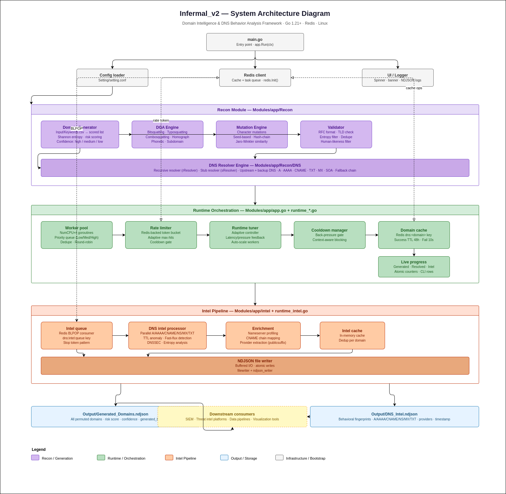

<div align="center">

# INFERMAL_v2

**Domain Intelligence & DNS Behavior Analysis Framework**

[](https://golang.org/)
[](https://github.com/)
[](LICENSE)
[](https://github.com/)
[](https://redis.io/)
[](https://www.kernel.org/)

*High-throughput domain permutation, DNS resolution, and behavioral intelligence at scale.*

---

[Overview](#overview) · [Disclaimer](#disclaimer) · [Architecture](#architecture) · [Features](#-features) · [Getting Started](#-getting-started) · [Configuration](#-configuration) · [API Control Plane](#api-control-plane) · [Use Cases](#-use-cases) · [Contributing](#-contributing)

</div>

---

## Overview

**Infermal\_v2** is a modular, high-performance framework for generating, resolving, analyzing, and correlating domain intelligence at scale. Built for offensive security research, threat intelligence operations, and DNS telemetry analysis, it integrates domain mutation logic, distributed worker pipelines, and behavioral enrichment into a single cohesive lifecycle.

```
Domain Generation → DNS Resolution → Intelligence Extraction → Correlation → Output
```

The framework is designed to be **operationally silent**, **horizontally scalable**, and **SIEM-ready** — producing structured NDJSON output that plugs directly into existing threat intelligence pipelines.

> **Note:** Infermal\_v2 is an independent research project and is not affiliated with or derived from the INFERMAL (2024) study by ICANN and KORLabs. Unlike registration-focused research, this framework targets live DNS behavior, infrastructure evolution, and operational lifecycle patterns.

---

## Disclaimer

Infermal_v2 is developed for cybersecurity research, threat intelligence, and defensive analysis.

The system simulates adversarial domain generation and DNS behavior to study infrastructure patterns and improve detection capabilities.

It is not intended for malicious use. Users are responsible for ensuring compliance with applicable laws and ethical standards when using this software.

---

## Architecture

The system follows a strict unidirectional pipeline with adaptive feedback loops at the runtime layer.

### High-Level System Architecture

> **Diagram:** `Infermal_v2-SAD.drawio.png` — Full system architecture diagram including all modules, runtime orchestration, intel pipeline, and output layer. 



### Data Flow

> **Diagrams:** Two-part data flow diagram tracing every data transformation from input to output.
> - `Infermal_v2-DataFlow-Part1.drawio.png` — Input → Domain Generation → DNS Resolution (Processes P1–P11)
> - `Infermal_v2-DataFlow-Part2.drawio.png` — Intel Queue → Enrichment → NDJSON Output (Processes P12–P19)
>
> Open with [draw.io](https://app.diagrams.net/) for editing. Both diagrams use standard DFD notation (processes as ellipses, data stores as open rectangles, external entities as rectangles, solid arrows for data flow, dashed arrows for control/feedback).

---

## Features

### Domain Mutation Engine

Generates adversarial and impersonation domain candidates from seed keywords using seven distinct algorithms:

| Algorithm | Description |
|-----------|-------------|
| **Bitsquatting** | Single-bit flips in character encoding |
| **Typosquatting** | Adjacent-key and common keyboard substitutions |
| **Combosquatting** | Keyword combination and brand appending |
| **Homograph attacks** | Visually similar Unicode character substitution |
| **Phonetic mutations** | Sound-alike character and syllable replacement |
| **Jaro–Winkler similarity** | String-distance-based permutation scoring |
| **Subdomain permutations** | Prefix and subdomain label variations |

All candidates are deduplicated, RFC-validated, scored via Shannon entropy and lexical heuristics, and filtered through a human-likeness threshold before proceeding to resolution.

### High-Speed DNS Engine

The resolution layer is built for throughput and resilience:

- Dual-mode resolution: **recursive** (`rResolver`) and **stub** (`sResolver`) with automatic fallback
- Supported record types: `A`, `AAAA`, `CNAME`, `TXT`, `MX`, `SOA`
- Configurable upstream and backup resolver endpoints
- Per-task timeouts driven by the adaptive runtime tuner
- Worker pool: `NumCPU × 4` goroutines with priority queuing (Low / Medium / High)

### Adaptive Runtime Engine

The runtime tuner continuously observes DNS latency, error rates, and queue depth to dynamically adjust:

- **Rate limit** — Redis-backed token bucket, max-hits updated per evaluation interval
- **Resolve timeout** — scaled to observed p95 latency
- **Cooldown** — back-pressure gate triggered on sustained pressure to prevent resolver overload

All tuning decisions are logged with pressure score, in-flight count, and active worker metrics.

### API Control Plane (Port `9090`)

Infermal_v2 now runs behind an API control layer:

- `go run .` starts the API server on `:9090`
- Scan lifecycle is controlled via API (`start`, `status`, `metrics`, `events`, `stop`)
- Endpoint contract is loaded from `APIs/Endpoint.ndjson` (single source of truth)
- Auth is `ed25519` public-key based (`X-API-Key`) with strict constant-time matching

### Intelligence Extraction

Resolved domains are enriched with full behavioral fingerprints via parallel DNS lookups:

- `A` / `AAAA` record enumeration and IP rotation detection
- `CNAME` chain mapping and depth analysis
- `NS` nameserver profiling
- `MX` and `TXT` record extraction
- **Provider attribution** via `publicsuffix.EffectiveTLDPlusOne` — identifies hosting infrastructure from CNAME and NS data without hardcoded vendor lists
- **TTL anomaly** and fast-flux pattern detection
- **DNSSEC** validation status
- **Entropy analysis** on label structure

### Distributed Processing via Redis

Redis serves three distinct roles in the pipeline:

| Role | Key Pattern | Notes |
|------|-------------|-------|
| DNS cache | `dns:<domain>` | TTL 48h on resolve success, 10s on failure |
| Rate limiter | `dns-rate` | Token bucket; adaptive max-hits |
| Intel queue | `dns:intel:queue` | RPUSH / BLPOP pattern; 20-minute TTL; stop-token drain |

### Output System

All output is written as **newline-delimited JSON (NDJSON)** for streaming compatibility:

| File | Contents |
|------|----------|
| `Output/Generated_Domain.ndjson` | Generated domains with risk score, confidence, and source algorithm metadata |
| `Output/Resolved_Domain.ndjson` | Final resolved domains that passed runtime resolution pipeline |
| `Output/DNS_Intel.ndjson` | A/AAAA/CNAME/NS/MX/TXT records, provider list, UTC timestamp |
| `Output/Run_Metrics.ndjson` | Run-level duration, totals, QPS, and rate-limit telemetry snapshot |
| `Output/QPS_History_<timestamp>.ndjson` | Time-series QPS and progress history sampled during execution |

Output integrates directly with SIEM platforms, data pipelines, and visualization tooling.

---

## Getting Started

### Prerequisites

| Dependency | Version | Notes |
|------------|---------|-------|
| Go | 1.21+ | Required |
| Redis | 6.0+ | Must be running before launch |
| Linux | Any modern kernel | Recommended; macOS may work |

### Installation

```bash
git clone https://github.com/Mr-Biswadeb-Mukherjee/Infermal_v2.git
cd Infermal_v2
go mod tidy
```

### Configuration

All runtime parameters are controlled via `Setting/setting.conf`. The file is auto-created with safe defaults on first run if absent.

```ini
# DNS resolver endpoints
upstream_dns    = 8.8.8.8:53
backup_dns      = 1.1.1.1:53
dns_timeout_ms  = 3000
dns_retries     = 2

# Worker and rate control
rate_limit      = 0          # 0 = auto-seed based on domain count
max_retries     = 3
auto_scale      = true
timeout_seconds = 0          # 0 = auto-seed

# Output
log_level       = info
```

Redis is configured separately via `Setting/redis.yaml`:

```yaml
host: localhost
port: 6379
db: 0
password: ""
pool_size: 10
```

### Input

Place target keywords in `Engine/Input/Keywords.csv`, one keyword per row. The generator will produce all permutations across all enabled algorithms.

```
google
microsoft
paypal
binance
```

### Run

```bash
go run .
```

On startup, the server prints the public key for admin distribution:

```
Infermal API public key: pubkey_ed25519 <token> Infermal_v2
Infermal API listening on :9090
```

Trigger a scan lifecycle via API:

```bash
BASE="http://localhost:9090"
PUB_KEY="pubkey_ed25519 <token> Infermal_v2"

curl -s -X POST "$BASE/api/v3/control/start" -H "X-API-Key: $PUB_KEY"
curl -s "$BASE/api/v3/control/status"        -H "X-API-Key: $PUB_KEY"
curl -s -X POST "$BASE/api/v3/control/stop"  -H "X-API-Key: $PUB_KEY"
```

---

## API Control Plane

### Endpoint Contract

All API routes and auth requirements are declared in:

- `APIs/Endpoint.ndjson`

This avoids production drift by keeping endpoint definitions in a single contract file.

### Authentication Model

- Server stores an `ed25519` **private key**.
- Client authenticates using the derived `ed25519` **public key** via header: `X-API-Key`.
- Public key is printed in server terminal on startup.
- Public key is not exposed via API endpoints.
- Any different/invalid key is rejected as unauthenticated (`401`).

Public key format:

- `pubkey_ed25519 <base64-public-key> Infermal_v2`

Private key source priority:

1. `INFERMAL_API_PRIVATE_KEY` (explicit environment override)
2. `INFERMAL_API_PRIVATE_KEY_PATH` (file path override)
3. default file path: `Setting/api_private.key`

If no private key exists, Infermal generates one and stores it at the configured path.
As long as this private key is preserved, restarts keep the same public key.
If the private key is deleted or replaced, a new public key is derived and previous clients fail authentication.

### Control Endpoints

| Endpoint | Method | Auth |
|----------|--------|------|
| `/healthz` | `GET` | No |
| `/api/v3/control/start` | `POST` | Yes |
| `/api/v3/control/stop` | `POST` | Yes |
| `/api/v3/control/status` | `GET` | Yes |
| `/api/v3/control/metrics` | `GET` | Yes |
| `/api/v3/control/events.ndjson` | `GET` | Yes |
| `/api/v3/details` | `GET` | Yes |

### Quick Test with curl

```bash
BASE="http://localhost:9090"
PUB_KEY="pubkey_ed25519 <token> Infermal_v2"

curl -s "$BASE/healthz"
curl -s -X POST "$BASE/api/v3/control/start"  -H "X-API-Key: $PUB_KEY"
curl -s "$BASE/api/v3/control/status"         -H "X-API-Key: $PUB_KEY"
curl -s "$BASE/api/v3/control/metrics"        -H "X-API-Key: $PUB_KEY"
curl -s "$BASE/api/v3/details?section=session,metrics,generated&limit=20" -H "X-API-Key: $PUB_KEY"
curl -s -X POST "$BASE/api/v3/control/stop"   -H "X-API-Key: $PUB_KEY"
```

`/api/v3/details` query params:

- `section`: comma-separated sections (`session`, `metrics`, `generated`, `resolved`, `dns_intel`, `run_metrics`, `qps_history`) or `all`
- `limit`: required positive integer from client (for example `50000`, `100000`) to control NDJSON rows returned per file-backed section

Negative test:

```bash
curl -i -X POST "$BASE/api/v3/control/start" -H "X-API-Key: invalid-key"
```


## Use Cases

| Use Case | Description |
|----------|-------------|
| **Threat intelligence enrichment** | Build behavioral profiles of adversarial domain infrastructure |
| **Phishing infrastructure detection** | Enumerate and resolve lookalike domains at scale |
| **Red team reconnaissance** | Map DNS footprint and identify squatted assets pre-engagement |
| **Domain monitoring** | Continuous permutation resolution against monitored brand keywords |
| **Incident response** | Rapid enumeration of IOC-adjacent domain variants |
| **DNS telemetry research** | Long-run behavioral studies of DNS response patterns |

---

## Output Schema

### `Generated_Domain.ndjson`

```json
{
  "domain": "g00gle.com",
  "risk_score": 0.81,
  "confidence": "high",
  "generated_by": "bitsquatting,typo_squat"
}
```

### `Resolved_Domain.ndjson`

```json
{
  "domain": "example-resolved.com",
  "score": 0.64,
  "confidence": "medium",
  "generated_by": "typo_squat,bitsquatting",
  "resolution": "resolved"
}
```

### `DNS_Intel.ndjson`

```json
{
  "domain": "g00gle.com",
  "a": ["192.0.2.1"],
  "aaaa": [],
  "cname": ["cdn.provider.net."],
  "ns": ["ns1.registrar.com.", "ns2.registrar.com."],
  "mx": [],
  "txt": ["v=spf1 include:mailgun.org ~all"],
  "providers": ["provider.net", "registrar.com"],
  "timestamp": "2026-03-21T14:50:06Z"
}
```

---

## System Diagrams

The `System Design/` directory contains three fully editable draw.io diagrams:

| File | Description |
|------|-------------|
| `Infermal_v2-SAD.drawio` | **System Architecture Diagram** — end-to-end component view across all five layers: bootstrap, recon, runtime orchestration, intel pipeline, and output |
| `Infermal_v2-DataFlow-Part1.drawio` | **Data Flow — Part 1** — traces data from `Keywords.csv` through domain generation, scoring, validation, cache lookup, rate limiting, and DNS resolution (Processes P1–P11) |
| `Infermal_v2-DataFlow-Part2.drawio` | **Data Flow — Part 2** — traces resolved domains through the Redis intel queue, parallel enrichment lookups, provider extraction, sanitization, and NDJSON file output (Processes P12–P19) |


---

## Performance Characteristics

| Parameter | Default Behavior |
|-----------|-----------------|
| Worker concurrency | `NumCPU × 4` goroutines |
| Rate limit seed | `workers × 8` req/s (auto-scales with domain count) |
| Resolve timeout | 2–4s (adaptive, scales with corpus size) |
| Cache TTL (success) | 48 hours |
| Cache TTL (failure) | 10 seconds |
| Intel queue TTL | 20 minutes |
| Evaluation interval | ~3 seconds |

The adaptive controller uses a snapshot of queue depth, in-flight tasks, and completed delta at each evaluation tick to continuously tune rate, timeout, and cooldown decisions without operator intervention.

---

## Development

### Running Tests

```bash
go test ./...
```

### Coverage

```bash
go test -coverprofile=coverage.out ./...
go tool cover -html=coverage.out
```

### Lint

```bash
go vet ./...
staticcheck ./...
```

### Build

```bash
go build -o infermal_v2 .
```

---

## Contributing

Contributions are welcome. For major changes, open an issue first to discuss design approach and architectural impact before submitting a pull request.

**Workflow:**

1. Fork the repository
2. Create a feature branch (`git checkout -b feature/your-feature`)
3. Commit with clear messages (`git commit -m 'feat: describe change'`)
4. Push and open a pull request against `main`

**Areas of interest:**

- Additional DGA algorithm implementations
- Alternative output formats (CEF, STIX 2.1, CSV)
- Passive DNS integration
- RDAP / WHOIS enrichment layer
- Extended DNSSEC chain validation
- gRPC streaming output interface

---

## License

This project is licensed under the **Apache License 2.0**.
See [LICENSE](LICENSE) for full terms.

---

## References

- INFERMAL Study — ICANN & KORLabs (2024): [Inferential Analysis of Maliciously Registered Domains](https://www.icann.org/resources/pages/inferential-analysis-maliciously-registered-domains-infermal-2024-12-03-en)
- [Go DNS library — miekg/dns](https://github.com/miekg/dns)
- [publicsuffix — golang.org/x/net](https://pkg.go.dev/golang.org/x/net/publicsuffix)

---

## Author

**Biswadeb Mukherjee**

Offensive Security Specialist · Malware Engineer

<h5><center>© 2026 Biswadeb Mukherjee. All rights reserved.
Licensed under the Apache License 2.0.</center></h5>

---

<div align="center">
<sub>Built for operators who need answers, not dashboards.</sub>
</div>
